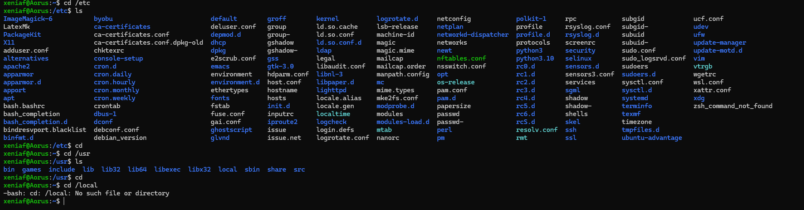
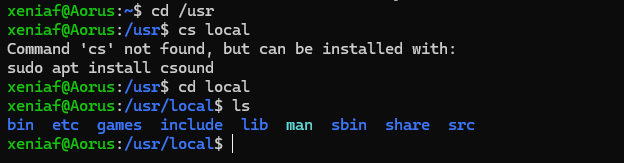
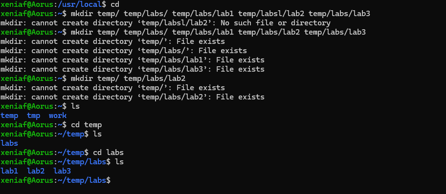
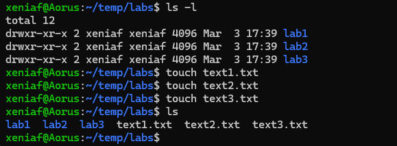
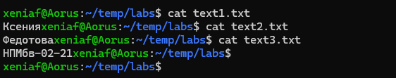
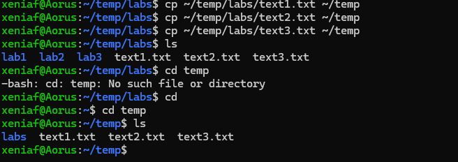
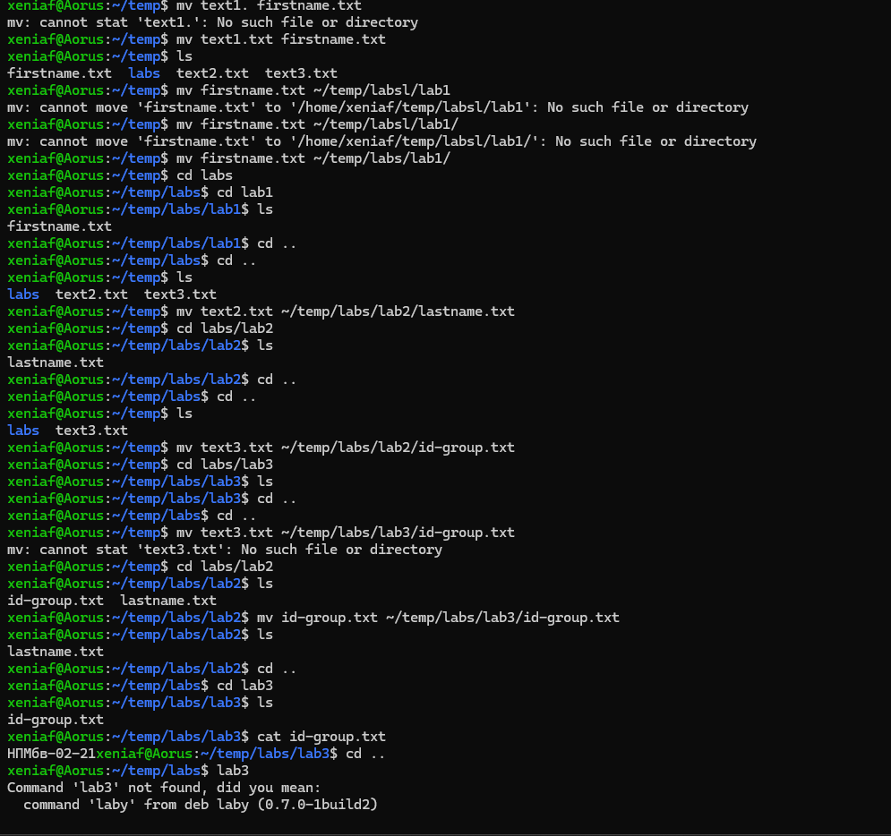
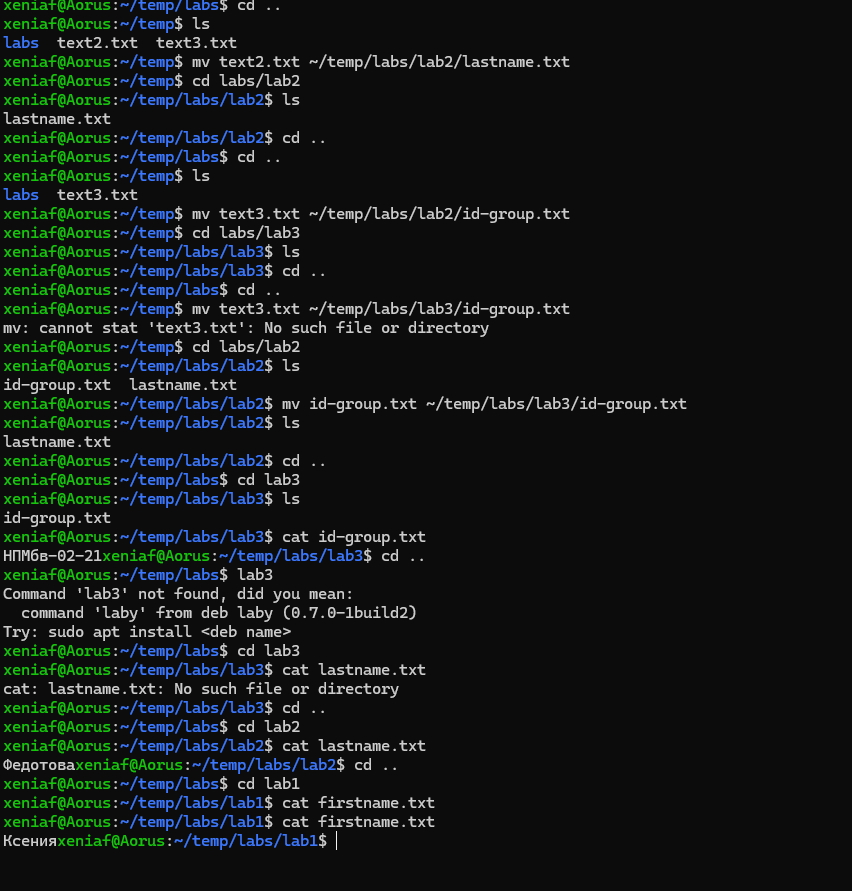

---
## Front matter
title: "Отчёта по лабораторной работе №1"
subtitle: "Архитектура компьютера"
author: "Федотова Ксения Алексеевна"

## Generic otions
lang: ru-RU
toc-title: "Содержание"

## Bibliography
bibliography: bib/cite.bib
csl: pandoc/csl/gost-r-7-0-5-2008-numeric.csl

## Pdf output format
toc: true # Table of contents
toc-depth: 2
lof: true # List of figures
lot: true # List of tables
fontsize: 12pt
linestretch: 1.5
papersize: a4
documentclass: scrreprt
## I18n polyglossia
polyglossia-lang:
  name: russian
  options:
	- spelling=modern
	- babelshorthands=true
polyglossia-otherlangs:
  name: english
## I18n babel
babel-lang: russian
babel-otherlangs: english
## Fonts
mainfont: PT Serif
romanfont: PT Serif
sansfont: PT Sans
monofont: PT Mono
mainfontoptions: Ligatures=TeX
romanfontoptions: Ligatures=TeX
sansfontoptions: Ligatures=TeX,Scale=MatchLowercase
monofontoptions: Scale=MatchLowercase,Scale=0.9
## Biblatex
biblatex: true
biblio-style: "gost-numeric"
biblatexoptions:
  - parentracker=true
  - backend=biber
  - hyperref=auto
  - language=auto
  - autolang=other*
  - citestyle=gost-numeric
## Pandoc-crossref LaTeX customization
figureTitle: "Рис."
tableTitle: "Таблица"
listingTitle: "Листинг"
lofTitle: "Список иллюстраций"
lotTitle: "Список таблиц"
lolTitle: "Листинги"
## Misc options
indent: true
header-includes:
  - \usepackage{indentfirst}
  - \usepackage{float} # keep figures where there are in the text
  - \floatplacement{figure}{H} # keep figures where there are in the text
---

# Цель работы

Приобретение практических навыков работы с операционной 
системой на уровне командной строки (организация файловой 
системы, навигация по файловой системе, создание и удаление 
файлов и директорий).

# Задание

1. Воспользовавшись командой pwd, узнайте полный путь к своей 
домашней директории.
2. Введите следующую последовательность команд
cd
mkdir tmp
cd tmp 
pwd 
cd /tmp 
pwd
Объясните, почему вывод команды pwd при переходе в каталог 
tmp дает разный результат.
3. Пользуясь командами cd и ls, посмотрите содержимое 
корневого каталога, домашнего каталога, каталогов /etc и 
/usr/local.
4. Пользуясь изученными консольными командами, в своём 
домашнем каталоге создайте каталог temp и каталог labs с 
подкатологами lab1, lab2 и lab3 одной командой. В каталоге temp
создайте файлы text1.txt,text2.txt,text3.txt. Пользуясь командой ls, 
убедитесь, что все действия выполнены успешно (каталоги и 
файлы созданы).
5. C помощью любого текстового редактора (например, редактора 
mcedit) запишите в файл text1.txt свое имя, в файл text2.txt
фамилию, в файл text3.txt учебную группу. Выведите на экран 
содержимое файлов, используя команду cat.
1. Скопируйте все файлы, чьи имена заканчиваются на .txt, из 
каталога ~/temp в каталог labs. После этого переименуйте файлы 
каталога labs и переместите их: text1.txt переименуйте в 
firstname.txt и переместите в подкаталог lab1, text2.txt в 
lastname.txt в подкаталог lab2, text3.txt в id-group.txt в подкаталог 
lab3. Пользуясь командами ls и cat, убедитесь, что все действия 
выполнены верно.
2. Удалите все созданные в ходе выполнения лабораторной 
работы файлы и каталоги.

# Теоретическое введение

Операционная система (ОС)— это комплекс взаимосвязанных программ, 
предназначенных для управления ресурсами компьютера и организации взаимодействия с 
пользователем. Сегодня наиболее известными операционными системами являются ОС 
семейства Microsoft Windows и UNIX-подобные системы.
 GNU Linux — семейство переносимых, многозадачных и многопользовательских 
операционных систем, на базе ядра Linux, включающих тот или иной набор утилит и 
программ проекта GNU, и, возможно, другие компоненты. Как и ядро Linux, системы на 
его основе, как правило, создаются и распространяются в соответствии с моделью 
разработки свободного и открытого программного обеспечения (Open-Source Software). 
Linux-системы распространяются в основном бесплатно в виде различных дистрибутивов.
В ней используется Файловая структура GNU Linux, описание некоторых каталогов 
файловой системы приводится ниже в таблице:
/ Корневая директория, содержащая всю 
файловую
/bin Основные системные утилиты, 
необходимые как в однопользовательском 
режиме, так и при обычной работе всем 
пользователям (например: cat, ls, cp)
/etc Общесистемные конфигурационные файлы 
и файлы конфигурации установленных 
программ
/home Содержит домашние директории 
пользователей, которые, в свою очередь, 
содержат персональные настройки и данные 
пользователя
/media Точки монтирования для сменных 
носителей, таких как CD-ROM, DVD-ROM, 
flash
/root Домашняя директория пользователя root
/tmp Временные файлы
/usr Вторичная иерархия для данных 
пользователя; содержит большинство 
пользовательских приложений и утилит, 
используемых в многопользовательском 
режиме; может быть смонтирована по сети 
только для чтения и быть общей для 
нескольких машин
Несколько определений: 
 Полный или абсолютный путь — начинается от корня (/), образуется 
перечислением всех каталогов, разделённых прямым слешем (/), и завершается именем 
файла (например, полный путь к файлу addition.txt из каталога user в каталоге home, 
находящемся в корневом каталоге, будет иметь вид: /home/user/documents/addition.txt; 
 Относительный путь — так же как и полный путь, строится перечислением через 
(/) всех каталогов, но начинается от текущего каталога (каталога, в котором “находится” 
пользователь), т.е. пользователь, находясь в каталоге user, может обратиться к файлу 
addition.txt, указав относительный путь documents/addition.txt

# Выполнение лабораторной работы

1. Воспользовавшись командой pwd, узнала весь полный путь к своей домашней 
директории. 

{#fig:002 width=70%}

pwd в каталоге tmp выдает другой результат по причине того что у нас при переходе в 
него меняется полный путь

2. После ввела последовательность команд

{#fig:001 width=70%}

3. Пользуясь командами cd и ls, посмотрела содержимое корневого каталога, домашнего 
каталога, каталогов /etc и /usr/local.

{#fig:003 width=70%}

{#fig:004 width=70%}

4. В своём домашнем каталоге создала каталог temp и каталог labs с подкаталогами lab1, 
lab2 и lab3 одной командой. В каталоге temp создала файлы text1.txt,text2.txt,text3.txt. 
Пользуясь командой ls, убедилась, что все действия выполнены успешно

{#fig:005 width=70%}

{#fig:006 width=70%}

5. С помощью mcedit записала все нужные данные в файлы
1.После скопировала их в каталог labs, переименовала в firstname.txt и тд. и переместила

{#fig:007 width=70%}

{#fig:008 width=70%}

{#fig:009 width=70%}

{#fig:010 width=70%}

{#fig:011 width=70%}

2. Удалила все созданные в ходе выполнения лабораторной работы файлы и каталоги

{#fig:012 width=70%}

# Выводы

Научились пользоваться операционной системой Linux на 
уровне командной строки и на практике проверили свои навыки, 
а именно: организация файловой системы, навигация по 
файловой системе, создание и удаление файлов и директорий.

::: {#refs}
:::
