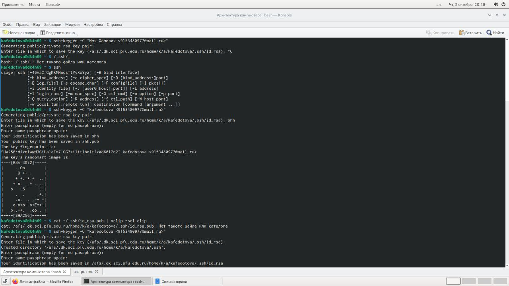
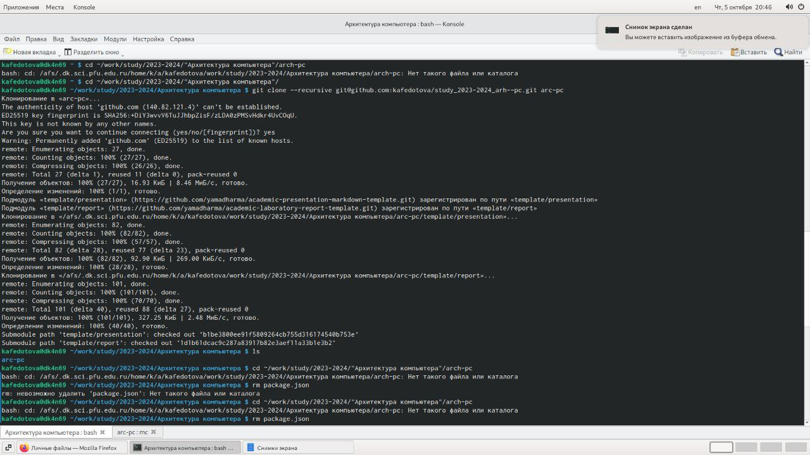
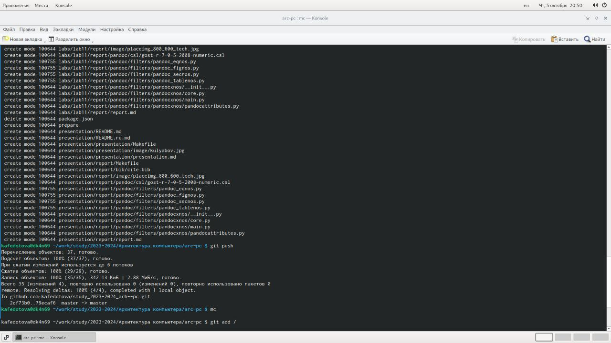
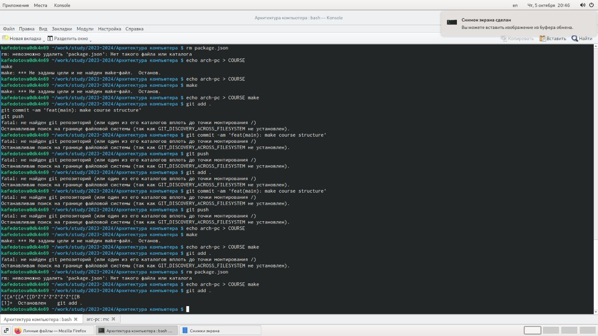

---
## Front matter
title: "Лабараторная работа 2"
subtitle: "Простейший вариант"
author: "Федотова Кения Алексеевна"

## Generic otions
lang: ru-RU
toc-title: "Содержание"

## Bibliography
bibliography: bib/cite.bib
csl: pandoc/csl/gost-r-7-0-5-2008-numeric.csl

## Pdf output format
toc: true # Table of contents
toc-depth: 2
lof: true # List of figures
lot: true # List of tables
fontsize: 12pt
linestretch: 1.5
papersize: a4
documentclass: scrreprt
## I18n polyglossia
polyglossia-lang:
  name: russian
  options:
	- spelling=modern
	- babelshorthands=true
polyglossia-otherlangs:
  name: english
## I18n babel
babel-lang: russian
babel-otherlangs: english
## Fonts
mainfont: PT Serif
romanfont: PT Serif
sansfont: PT Sans
monofont: PT Mono
mainfontoptions: Ligatures=TeX
romanfontoptions: Ligatures=TeX
sansfontoptions: Ligatures=TeX,Scale=MatchLowercase
monofontoptions: Scale=MatchLowercase,Scale=0.9
## Biblatex
biblatex: true
biblio-style: "gost-numeric"
biblatexoptions:
  - parentracker=true
  - backend=biber
  - hyperref=auto
  - language=auto
  - autolang=other*
  - citestyle=gost-numeric
## Pandoc-crossref LaTeX customization
figureTitle: "Рис."
tableTitle: "Таблица"
listingTitle: "Листинг"
lofTitle: "Список иллюстраций"
lotTitle: "Список таблиц"
lolTitle: "Листинги"
## Misc options
indent: true
header-includes:
  - \usepackage{indentfirst}
  - \usepackage{float} # keep figures where there are in the text
  - \floatplacement{figure}{H} # keep figures where there are in the text
---

# Цель работы

Целью работы является изучить идеологию и применение средств контроля версий. Приобрести практические навыки по работе с системой git.

#  Задания
1. Создайте отчет по выполнению лабораторной работы в соответствующем каталоге 
рабочего пространства (labs>lab02>report). 
2. Скопируйте отчеты по выполнению предыдущих лабораторных работ в 
соответствующие каталоги созданного рабочего пространства. 
3. Загрузите файлы на github.

#Теоретическое введение
Системы контроля версий (Version Control System, VCS) применяются при работе 
нескольких человек над одним проектом. Обычно основное дерево проекта хранится в 
локальном или удалённом репозитории, к которому настроен доступ для участников 
проекта. При внесении изменений в содержание проекта система контроля версий 
позволяет их фиксировать, совмещать изменения, произведённые разными участниками 
проекта, производить откат к любой более ранней версии проекта, если это требуется.
Система контроля версий Git представляет собой набор программ командной строки. 
Доступ к ним можно получить из терминала посредством ввода команды git с 
различными опциями. Благодаря тому, что Git является распределённой системой 
контроля версий, резервную копию локального хранилища можно сделать простым 
копированием или архивацией.
Наиболее часто используемые команды git представлены в таблице
Команда Описание
git init создание основного дерева репозитория
git pull получение обновлений (изменений) 
текущего дерева из центрального 
репозитория
git push отправка всех произведённых изменений 
локального дерева в центральный 
репозиторий
git status просмотр списка изменённых файлов в 
текущей директории
git diff просмотр текущих изменения
git add . добавить все изменённые и/или созданные 
файлы и/или каталоги
git add имена_файлов добавить конкретные изменённые и/или 
созданные файлы и/или каталоги
git rm имена_файлов удалить файл и/или каталог из индекса
репозитория (при этом файл и/или каталог 
остаётся в локальной директории)
git commit -am 'Описание коммита' сохранить все добавленные изменения и 
все изменённые файлы
git checkout -b имя_ветки создание новой ветки, базирующейся на 
текущей
git checkout имя_ветки переключение на некоторую ветку (при 
переключении на ветку, которой ещё нет в 
локальном репозитории, она будет создана 
и связана с удалённой)
git push origin имя_ветки отправка изменений конкретной ветки в 
центральный репозиторий
git merge --no-ff имя_ветки слияние ветки с текущим деревом
git branch -d имя_ветки удаление локальной уже слитой с основным 
деревом ветки
git branch -D имя_ветки принудительное удаление локальной ветки
git push origin :имя_ветки удаление ветки с центрального репозитория

# Выполнение лабораторной работы

1.Сначала сделала предварительную конфигурацию git. Открыла терминал и ввела
следующие команды, указав имя и email.
git config --global user.name "<Name Surname>"
git config --global user.email "<work@mail>"

2.Настроила utf-8 в выводе сообщений git:
git config --global core.quotepath false

Задала имя начальной ветки (будем называть её master):
git config --global init.defaultBranch master
 Параметр autocrlf:
git config --global core.autocrlf input
 Параметр safecrlf:
git config --global core.safecrlf warn (@fig:001)

3.Генерируем пару ключей Для последующей идентификации(приватный и открытый):
ssh-keygen -C "Имя Фамилия <work@mail>" (@fig:002)
4.Далее загрузила сгенерированный открытый ключ (@fig:003)

5.Открыла терминал и создала каталог для предмета «Архитектура компьютера»:
mkdir -p ~/work/study/2023-2024/"Архитектура компьютера"

6. Перешла на станицу репозитория с шаблоном курса https://github.com/yamadharma/cour
se-directory-student-template(какой-то рисуонк)

7.Откроыла терминал и перешла в каталог курса:
cd ~/work/study/2023–2024/"Архитектура компьютера"

8.Клонировала созданный репозиторий:
git clone --recursive git@github.com:<user_name>/study_2023–2024_arh-pc.git
↪ arch-pc

9.Настройка каталога курса
Перешла в каталог курса:
cd ~/work/study/2023-2024/"Архитектура компьютера"/arch-pc
Настройка каталога курса

Удалила лишние файлы:
rm package.json

Создала необходимые каталоги:
echo arch-pc > COURSE
make
Отправивила файлы на сервер:
git add .
git commit -am 'feat(main): make course structure'
git push

{#fig:001 width=70%}

{#fig:005 width=70%}

{#fig:002 width=70%}

{#fig:004 width=70%}

{#fig:003 width=70%}

# Выводы

Я изучила идеологию и применение средств контроля версий. Приобрести практические навыки по работе с системой git.

