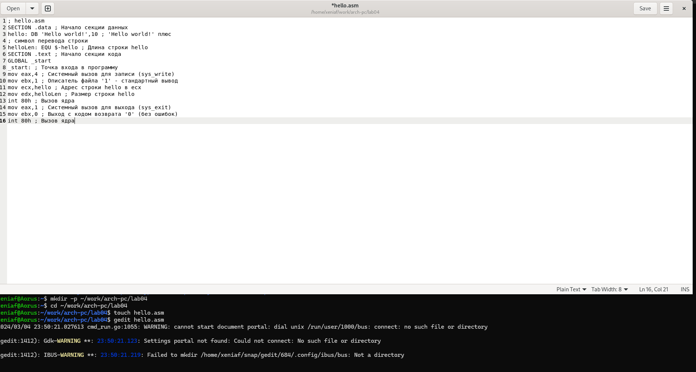
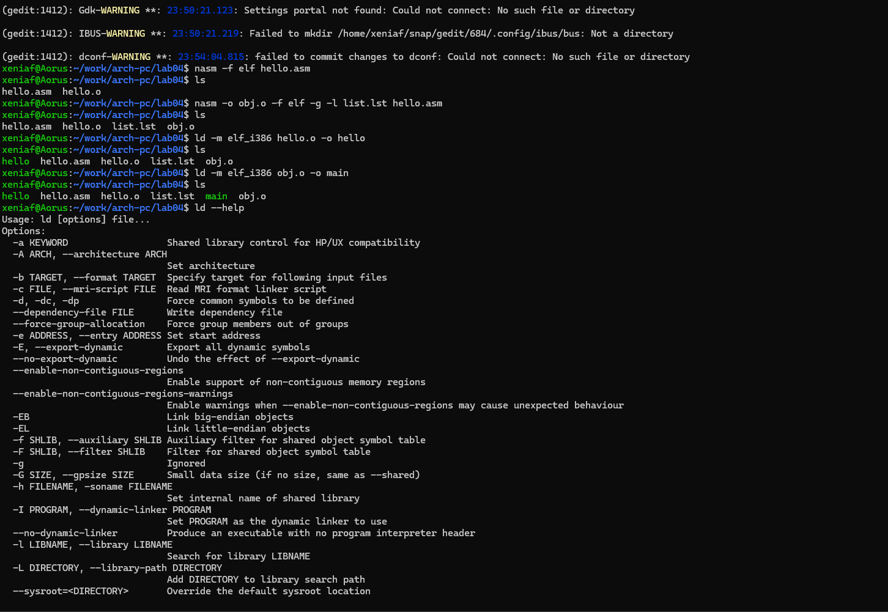
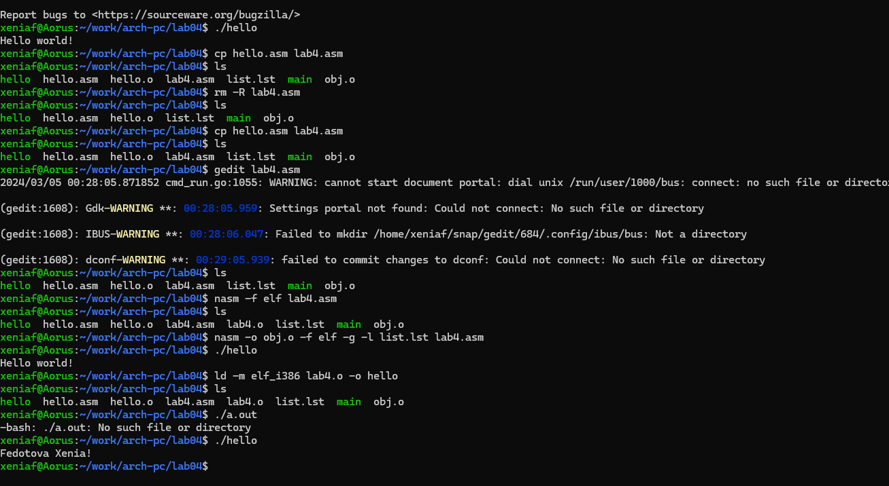

---
## Front matter
title: "Отчёта по лабораторной работе №4"
subtitle: "Простейший вариант"
author: "Федотова Ксения Алексеевна"

## Generic otions
lang: ru-RU
toc-title: "Содержание"

## Bibliography
bibliography: bib/cite.bib
csl: pandoc/csl/gost-r-7-0-5-2008-numeric.csl

## Pdf output format
toc: true # Table of contents
toc-depth: 2
lof: true # List of figures
lot: true # List of tables
fontsize: 12pt
linestretch: 1.5
papersize: a4
documentclass: scrreprt
## I18n polyglossia
polyglossia-lang:
  name: russian
  options:
	- spelling=modern
	- babelshorthands=true
polyglossia-otherlangs:
  name: english
## I18n babel
babel-lang: russian
babel-otherlangs: english
## Fonts
mainfont: PT Serif
romanfont: PT Serif
sansfont: PT Sans
monofont: PT Mono
mainfontoptions: Ligatures=TeX
romanfontoptions: Ligatures=TeX
sansfontoptions: Ligatures=TeX,Scale=MatchLowercase
monofontoptions: Scale=MatchLowercase,Scale=0.9
## Biblatex
biblatex: true
biblio-style: "gost-numeric"
biblatexoptions:
  - parentracker=true
  - backend=biber
  - hyperref=auto
  - language=auto
  - autolang=other*
  - citestyle=gost-numeric
## Pandoc-crossref LaTeX customization
figureTitle: "Рис."
tableTitle: "Таблица"
listingTitle: "Листинг"
lofTitle: "Список иллюстраций"
lotTitle: "Список таблиц"
lolTitle: "Листинги"
## Misc options
indent: true
header-includes:
  - \usepackage{indentfirst}
  - \usepackage{float} # keep figures where there are in the text
  - \floatplacement{figure}{H} # keep figures where there are in the text
---

# Цель работы

Освоение процедуры компиляции и сборки программ, написанных на ассемблере NASM.

# Задание

1.	В каталоге ~/work/arch-pc/lab04 с помощью команды cp создайте копию файла hello.asm с именем lab4.asm
2.	С помощью любого текстового редактора внесите изменения в текст программы в файле lab4.asm так, чтобы вместо Hello world! на экран выводилась строка с вашими фамилией и именем.
3.	Оттранслируйте полученный текст программы lab4.asm в объектный файл. Выполните компоновку объектного файла и запустите получившийся исполняемый файл.
4.	Скопируйте файлы hello.asm и lab4.asm в Ваш локальный репозиторий в ката- лог ~/work/study/2023-2024/“Архитектура компьютера”/arch-pc/labs/lab04/. Загрузите файлы на Github.

Программа Hello world!
Рассмотрим пример простой программы на языке ассемблера NASM. Традиционно первая
программа выводит приветственное сообщение Hello world! на экран.
Создайте каталог для работы с программами на языке ассемблера NASM:
mkdir -p ~/work/arch-pc/lab04
Перейдите в созданный каталог
cd ~/work/arch-pc/lab04
Создайте текстовый файл с именем hello.asm
touch hello.asm
откройте этот файл с помощью любого текстового редактора, например, gedit
gedit hello.asm
и введите в него следующий текст:
; hello.asm
SECTION .data ; Начало секции данных
hello: DB 'Hello world!',10 ; 'Hello world!' плюс
; символ перевода строки
helloLen: EQU $-hello ; Длина строки hello
SECTION .text ; Начало секции кода
GLOBAL _start
_start: ; Точка входа в программу
mov eax,4 ; Системный вызов для записи (sys_write)
mov ebx,1 ; Описатель файла '1' - стандартный вывод
mov ecx,hello ; Адрес строки hello в ecx
mov edx,helloLen ; Размер строки hello
int 80h ; Вызов ядра
mov eax,1 ; Системный вызов для выхода (sys_exit)
mov ebx,0 ; Выход с кодом возврата '0' (без ошибок)
int 80h ; Вызов ядра

{#fig:001 width=70%}

# Теоретическое введение

Основными функциональными элементами любой электронно-вычислительной машины
(ЭВМ) являются центральный процессор, память и периферийные устройства (рис. 4.1). Взаимодействие этих устройств осуществляется через общую шину, к которой они подклю- чены. Физически шина представляет собой большое количество проводников, соединяющих устройства друг с другом. В современных компьютерах проводники выполнены в виде элек- тропроводящих дорожек на материнской (системной) плате. Основной задачей процессора является обработка информации, а также организация координации всех узлов компьютера. В состав центрального процессора (ЦП) входят следующие устройства:
• арифметико-логическое устройство (АЛУ) — выполняет логические и арифметиче- ские действия, необходимые для обработки информации, хранящейся в памяти; • устройство управления (УУ) — обеспечивает управление и контроль всех устройств компьютера; • регистры — сверхбыстрая оперативная память небольшого объёма, входящая в со- став процессора, для временного хранения промежуточных результатов выполнения инструкций; регистры процессора делятся на два типа: регистры общего назначения и специальные регистры.
В состав ЭВМ также входят периферийные устройства, которые можно разделить на:
• устройства внешней памяти, которые предназначены для долговременного хране- ния больших объёмов данных (жёсткие диски, твердотельные накопители, магнитные ленты); • устройства ввода-вывода, которые обеспечивают взаимодействие ЦП с внешней средой.
**Язык ассемблера** (assembly language, сокращённо asm) — машинно-ориентированный
язык низкого уровня. Можно считать, что он больше любых других языков приближен к архитектуре ЭВМ и её аппаратным возможностям, что позволяет получить к ним более полный доступ, нежели в языках высокого уровня, таких как C/C++, Perl, Python и пр. Заметим, что получить полный доступ к ресурсам компьютера в современных архитектурах нельзя, самым низким уровнем работы прикладной программы является обращение напрямую к ядру операционной системы. Именно на этом уровне и работают программы, написанные на ассемблере. Но в отличие от языков высокого уровня ассемблерная программа содержит только тот код, который ввёл программист. Таким образом язык ассемблера — это язык, с помощью которого понятным для человека образом пишутся команды для процессора.

# Выполнение лабораторной работы

##Hello.asm
1.	В каталоге создала файл hello.asm командой.
touch hello.asm
2.	Войдя в него следующей командой:
gedit hello.asm
Ввела в него следующий текст, который позволит при компиляции вывести стандартную фразу ‘Hello world!’:
; hello.asm
SECTION .data ; Начало секции данных
hello: DB ‘Hello world!’,10 ; ‘Hello world!’ плюс
; символ перевода строки
helloLen: EQU $-hello ; Длина строки hello
SECTION .text ; Начало секции кода
**GLOBAL _start**
**_start: ; Точка входа в программу**
mov eax,4 ; Системный вызов для записи (sys_write)
mov ebx,1 ; Описатель файла ‘1’ - стандартный вывод
mov ecx,hello ; Адрес строки hello в ecx
mov edx,helloLen ; Размер строки hello
int 80h ; Вызов ядра
mov eax,1 ; Системный вызов для выхода (sys_exit)
mov ebx,0 ; Выход с кодом возврата ‘0’ (без ошибок)
int 80h ; Вызов ядра
3.	Превратила текст программы в объектный код следующей командой:
nasm -f elf hello.asm
4.	Теперь скомпилировала исходный файл hello.asm в obj.o, а также создадала файл листинга list.lst, с помощью ls проверила, что файлы были созданы.
nasm -o obj.o -f elf -g -l list.lst hello.asm
5.	Теперь осталось только запустить исполняемый файл следующей командой: 
./hello

{#fig:002 width=70%}
{#fig:003 width=70%}

# Выводы

Я освоила процедуры компиляции и сборки программ, написанных на ассемблере NASM.

