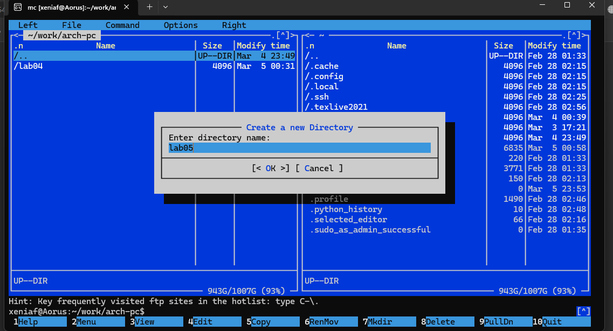
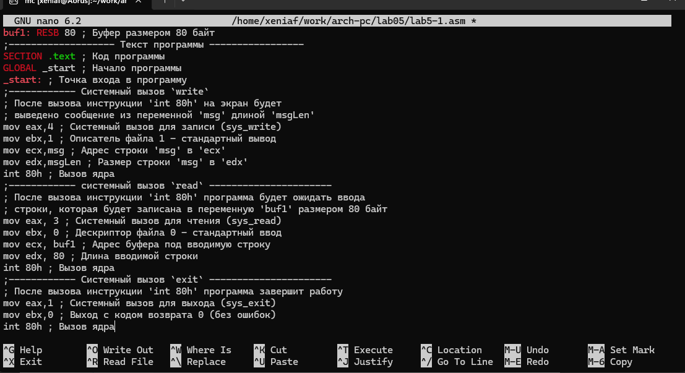
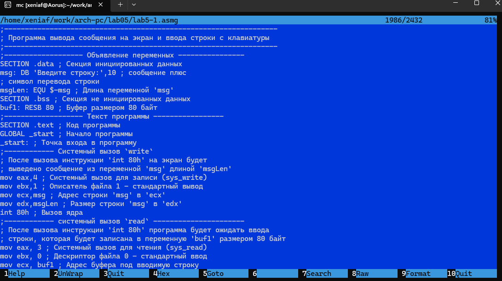
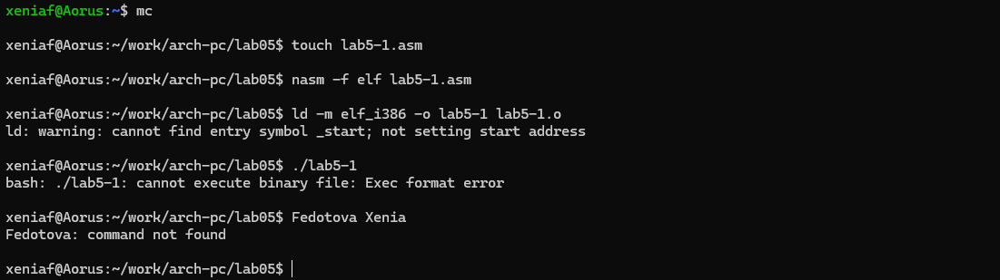
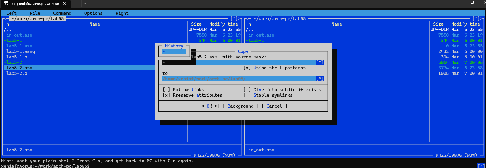

---
## Front matter
title: "Отчёта по лабораторной работе №5"
subtitle: "Простейший вариант"
author: "Федоотова Ксения Алексеевна"

## Generic otions
lang: ru-RU
toc-title: "Содержание"

## Bibliography
bibliography: bib/cite.bib
csl: pandoc/csl/gost-r-7-0-5-2008-numeric.csl

## Pdf output format
toc: true # Table of contents
toc-depth: 2
lof: true # List of figures
lot: true # List of tables
fontsize: 12pt
linestretch: 1.5
papersize: a4
documentclass: scrreprt
## I18n polyglossia
polyglossia-lang:
  name: russian
  options:
	- spelling=modern
	- babelshorthands=true
polyglossia-otherlangs:
  name: english
## I18n babel
babel-lang: russian
babel-otherlangs: english
## Fonts
mainfont: PT Serif
romanfont: PT Serif
sansfont: PT Sans
monofont: PT Mono
mainfontoptions: Ligatures=TeX
romanfontoptions: Ligatures=TeX
sansfontoptions: Ligatures=TeX,Scale=MatchLowercase
monofontoptions: Scale=MatchLowercase,Scale=0.9
## Biblatex
biblatex: true
biblio-style: "gost-numeric"
biblatexoptions:
  - parentracker=true
  - backend=biber
  - hyperref=auto
  - language=auto
  - autolang=other*
  - citestyle=gost-numeric
## Pandoc-crossref LaTeX customization
figureTitle: "Рис."
tableTitle: "Таблица"
listingTitle: "Листинг"
lofTitle: "Список иллюстраций"
lotTitle: "Список таблиц"
lolTitle: "Листинги"
## Misc options
indent: true
header-includes:
  - \usepackage{indentfirst}
  - \usepackage{float} # keep figures where there are in the text
  - \floatplacement{figure}{H} # keep figures where there are in the text
---

# Цель работы

Приобретение практических навыков работы в Midnight Commander. Освоение инструкций
языка ассемблера mov и int.

# Задание

1. Создайте копию файла lab5-1.asm. Внесите изменения в программу (без
использова- ния внешнего файла in_out.asm), так чтобы она работала по
следующему алгоритму: • вывести приглашение типа “Введите строку:”; •
ввести строку с клавиатуры; • вывести введённую строку на экран.
2. Получите исполняемый файл и проверьте его работу. На приглашение ввести строку введите свою фамилию.
3. Создайте копию файла lab5-2.asm. Исправьте текст программы с использование под- программ из внешнего файла in_out.asm, так чтобы она работала
по следующему алгоритму: • вывести приглашение типа “Введите строку:”;
• ввести строку с клавиатуры; • вывести введённую строку на экран. Не
забудьте, подключаемый файл in_out.asm должен лежать в том же каталоге,
что и файл с программой, в которой он используется.
4. Создайте исполняемый файл и проверьте его работу

# Теоретическое введение

Midnight Commander (или просто mc) — это программа, которая позволяет
просматривать структуру каталогов и выполнять основные операции по управлению файловой системой, т.е. mc является файловым менеджером. Midnight
Commander позволяет сделать работу с файлами более удобной и наглядной. Для
активации оболочки Midnight Commander достаточно ввести в командной строке
mc и нажать клавишу Enter. В Midnight Commander используются функциональные клавиши F1 — F10 , к которым привязаны часто выполняемые операции
Программа на языке ассемблера NASM, как правило, состоит из трёх секций:
секция кода программы (SECTION .text), секция инициированных (известных во
время компиляции) данных (SECTION .data) и секция неинициализированных
данных (тех, под которые во время компиляции только отводится память, а
значение присваивается в ходе выполнения программы) (SECTION .bss).
Для объявления инициированных данных в секции .data используются директивы DB, DW, DD, DQ и DT, которые резервируют память и указывают, какие
значения должны храниться в этой памяти: • DB (define byte) — определяет переменную размером в 1 байт; • DW (define word) — определяет переменную
размеров в 2 байта (слово); • DD (define double word) — определяет переменную размером в 4 байта (двойное слово); • DQ (define quad word) — определяет
переменную размером в 8 байт (учетверённое слово); • DT (define ten bytes) —
определяет переменную размером в 10 байт.
Директивы используются для объявления простых переменных и для объявления масси- вов. Для определения строк принято использовать директиву DB связи с особенностями хранения данных в оперативной памяти.

# Выполнение лабораторной работы

1. Открвла Midnight Commander:

user@dk4n31:~$ mc
2. Пользуясь клавишами ↑ , ↓ и Enter перешла в каталог ~/work/arch-pc созданный
при выполнении лабораторной работы №4.

3. С помощью функциональной клавиши F7 создал папку lab05 и перешла
в созданный каталог.

4. Пользуясь строкой ввода и командой touch создала файл lab5-1.asm.

5. С помощью функциональной клавиши F4 открskf файл lab5-1.asm для редактирования во встроенном редакторе. 

6. Ввела текст программы из листинга: 

;—————————————————————— ; Программа вывода сообщения на
экран и ввода строки с клавиатуры ;——————————————————————
;——————- Объявление переменных —————- SECTION .data ; Секция инициированных данных msg: DB ‘Введите строку:’,10 ; сообщение плюс ; символ
перевода строки msgLen: EQU $-msg ; Длина переменной ‘msg’ SECTION .bss
; Секция не инициированных данных buf1: RESB 80 ; Буфер размером 80 байт
;——————- Текст программы —————– SECTION .text ; Код программы GLOBAL
_start ; Начало программы _start: ; Точка входа в программу ;———— Cистемный
вызов write ; После вызова инструкции ‘int 80h’ на экран будет ; выведено сообщение из переменной ‘msg’ длиной ‘msgLen’ mov eax,4 ; Системный вызов
для записи (sys_write) mov ebx,1 ; Описатель файла 1 - стандартный вывод mov
ecx,msg ; Адрес строки ‘msg’ в ‘ecx’ mov edx,msgLen ; Размер строки ‘msg’ в ‘edx’
int 80h ; Вызов ядра ;———— системный вызов read ———————- ; После вызова
инструкции ‘int 80h’ программа будет ожидать ввода ; строки, которая будет
записана в переменную ‘buf1’ размером 80 байт mov eax, 3 ; Системный вызов
для чтения (sys_read) mov ebx, 0 ; Дескриптор файла 0 - стандартный ввод mov ecx,
buf1 ; Адрес буфера под вводимую строку mov edx, 80 ; Длина вводимой строки
int 80h ; Вызов ядра ;———— Системный вызов exit ———————- ; После вызова
инструкции ‘int 80h’ программа завершит работу mov eax,1 ; Системный вызов
для выхода (sys_exit) mov ebx,0 ; Выход с кодом возврата 0 (без ошибок) int 80h ;

Сохраните изменения и закрыла файл.

{#fig:001 width=70%}
{#fig:002 width=70%}

7. С помощью функциональной клавиши F3 открыла файл lab5-1.asm для просмотра.
Убедилась, что файл содержит текст программы.

{#fig:003 width=70%}

8. Оттранслировала текст программы lab5-1.asm в объектный файл. Выполнила компоновку объектного файла и запустила получившийся исполняемый исполняемый файл. Программа выводит строку 'Введите строку:' и ожидает ввода с клавиатуры. На запрос введите
Ваши ФИО.
user@dk4n31:~$ nasm -f elf lab5-1.asm
user@dk4n31:~$ ld -m elf_i386 -o lab5-1 lab5-1.o
user@dk4n31:~$ ./lab5-1
Введите строку:
Имя пользователя
user@dk4n31:~$

{#fig:004 width=70%}

9. Скачала файл in_out.asm со страницы курса в ТУИС.

10. Создала копию файла lab5-1.asm: lab.5-2copy.asm и внесла изменения в программу (без использова- ния внешнего файла in_out.asm).

{#fig:005 width=70%}

# Выводы

Таким образом я приобрела практические навыков работы в Midnight
Commander. Также немного освоила инструкции языка ассемблера mov и int.

::: {#refs}
:::
